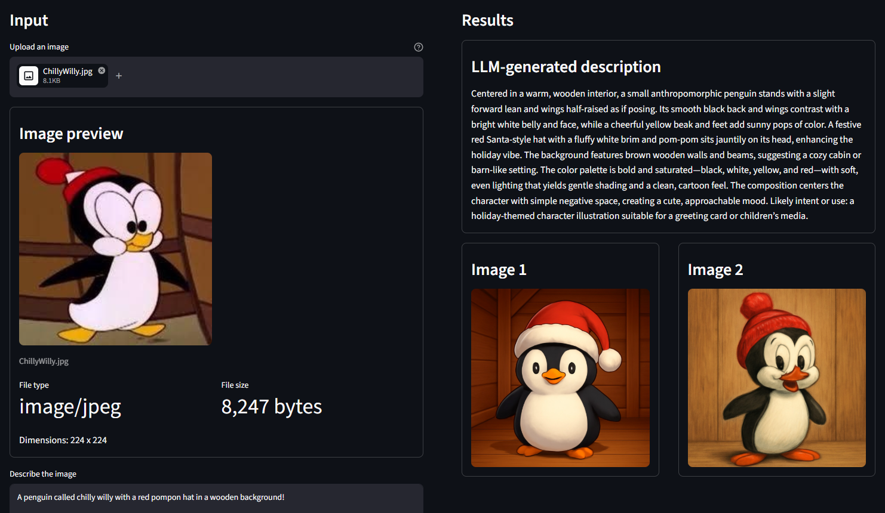

# Image Ideation

Streamlit app for turning one uploaded image into two AI-generated image ideas:

- one based on an OpenAI-generated description of the uploaded image
- one based on the user’s optional description

## Preview



## Requirements

- Python 3.13+
- `uv`
- OpenAI API key

## Setup

1. Create a virtual environment and install dependencies:

```bash
uv sync --extra dev
```

2. Copy `.env.example` to `.env` and set your OpenAI key:

```bash
OPENAI_API_KEY=your_api_key_here
```

3. Run the app:

```bash
uv run streamlit run app.py
```

## How to use the app

1. Upload an image.
2. Review the image preview and metadata.
3. Optionally add your own description of the image.
4. Press **Imagine**.
5. Wait for the app to:
   - describe the uploaded image with OpenAI
   - generate the first image from that description
   - generate the second image from your description, if provided
6. Review the results side by side in the app.

## Environment variables

- `OPENAI_API_KEY` required
- `OPENAI_TEXT_MODEL` optional
- `OPENAI_IMAGE_MODEL` optional

## Notes

- The app uses Streamlit session state to keep uploaded image data and generated results across reruns.
- If no custom description is entered, the second image is skipped.
